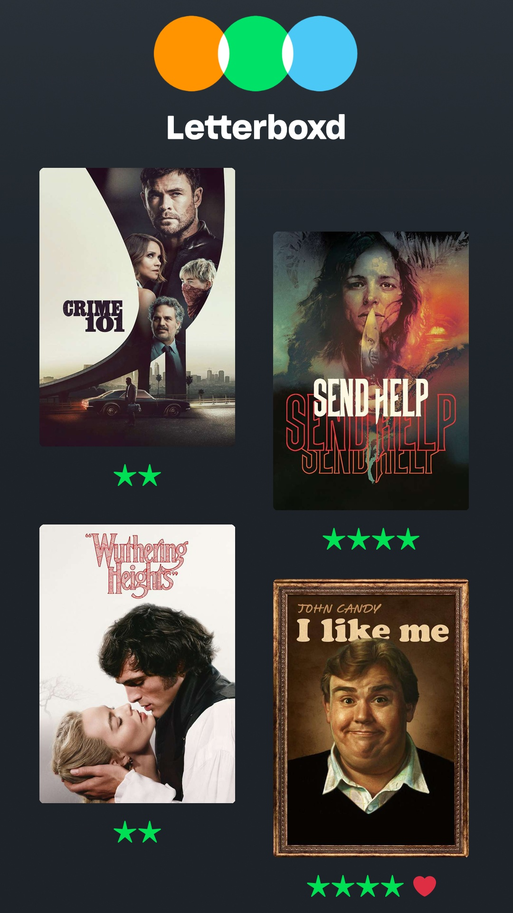

# instaboxd

A Python script that generates an Instagram Story image from your latest [Letterboxd](https://letterboxd.com) film diary entries.

It fetches your 4 most recently logged films via the Letterboxd RSS feed and composites their posters, star ratings, and heart (liked) indicators onto a 1080x1920 story-sized canvas.

## Example Output



## Requirements

- Python 3.13+
- [uv](https://github.com/astral-sh/uv) (for dependency management and running the script)
- A Letterboxd account with a public profile
- Arial Unicode font installed at `/Library/Fonts/Arial Unicode.ttf` (macOS)

## Installation

```bash
git clone https://github.com/ashleyconnor/instaboxd_script.git
cd instaboxd_script
uv sync
```

## Usage

1. Set your Letterboxd username in [generate.py](generate.py#L9):

   ```python
   LETTERBOXD_USERNAME = "your_username"
   ```

2. Replace `background.png` with your own background image (1080x1920 recommended).

3. Run the script:

   ```bash
   just
   ```

   Or directly with uv:

   ```bash
   uv run python generate.py
   ```

The output is saved as `letterboxd_story.jpg` in the project directory.

## Dependencies

| Package      | Purpose                                                 |
| ------------ | ------------------------------------------------------- |
| `feedparser` | Parse the Letterboxd RSS feed                           |
| `Pillow`     | Image compositing and drawing                           |
| `pilmoji`    | Render emoji in image text (for the ❤️ liked indicator) |
| `requests`   | Fetch movie poster images                               |
